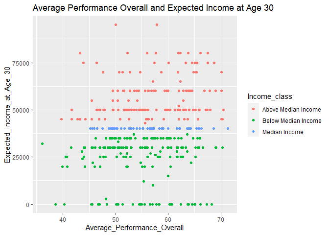
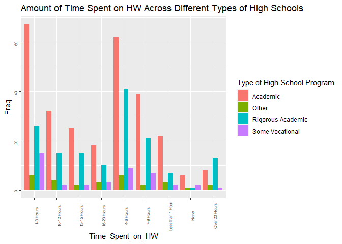

Exploring Relationships of Data Pertaining to Eighth Graders in 1988
================

## Explanation of Program

The following program is designed to explore relationships between
variables of interest, pertaining to eighth graders in 1988. Through
built-in functions and custom made functions, the goal of the program
centers around calculating summary statistics of the relationship
between two variables, and visualize their relationships. Another aim of
the analysis is to illustrate the variables that are associated with
scholarly achievements and academic improvement.

### Preparing to Load the Dataset

In this block of code, I am importing the packages and libraries that I
will use for this project

``` r
library(readxl)
```

    ## Warning: package 'readxl' was built under R version 4.1.3

``` r
library(tidyverse)
```

    ## Warning: package 'tidyverse' was built under R version 4.1.2

    ## -- Attaching packages --------------------------------------- tidyverse 1.3.1 --

    ## v ggplot2 3.3.5     v purrr   0.3.4
    ## v tibble  3.1.2     v dplyr   1.0.7
    ## v tidyr   1.1.3     v stringr 1.4.0
    ## v readr   1.4.0     v forcats 0.5.1

    ## -- Conflicts ------------------------------------------ tidyverse_conflicts() --
    ## x dplyr::filter() masks stats::filter()
    ## x dplyr::lag()    masks stats::lag()

``` r
library("ggplot2")
library(magrittr)
```

    ## 
    ## Attaching package: 'magrittr'

    ## The following object is masked from 'package:purrr':
    ## 
    ##     set_names

    ## The following object is masked from 'package:tidyr':
    ## 
    ##     extract

``` r
library(dplyr)
```

Here, I am reading in the data and getting acquainted with the variables
in the dataframe

``` r
df <- read_excel("NELS.xlsx")
head(df)
```

    ## # A tibble: 6 x 48
    ##   `Case Number` `Advanced Math Taken in Eig~` Urbanicity `Geographic Re~` Gender
    ##           <dbl> <chr>                         <chr>      <chr>            <chr> 
    ## 1           254 Yes                           Suburban   South            Female
    ## 2           265 Yes                           Urban      South            Female
    ## 3           364 Yes                           Rural      Northeast        Male  
    ## 4           496 No                            Suburban   West             Female
    ## 5            96 No                            Suburban   North Central    Male  
    ## 6           263 No                            Urban      South            Female
    ## # ... with 43 more variables: `Family Size` <dbl>,
    ## #   `Parents' Marital Status in Eighth Grade` <chr>,
    ## #   `Home Language Background` <chr>, `Self-Concept in Eighth Grade` <dbl>,
    ## #   `Self-Concept in Tenth Grade` <dbl>, `Self-Concept in Twelfth Grade` <dbl>,
    ## #   `School Type in Eighth Grade` <chr>,
    ## #   `My Teachers are Interested in Students` <chr>,
    ## #   `Number Times Late for School in Twelfth Grade` <chr>, ...

## Gender and Advanced Placement Program Enrollment

The following analysis will be in two parts. Firstly, I will determine
how many females and males took an AP course and how many of them did
not. In this analysis, the variables that will be analyzed are: Gender,
AP Taken? ,Expected Income at the Age of 30

### Code Summary

Subsets the data into the three variables of interests and filter out
messy data. The resulting data frame is then converted into a table, and
table is converted back into a data frame. Frequency table is then
plotted.

``` r
#Here, I am subsetting the data by the columns of interest
subset_AP = df[, c("Gender", "Advanced Placement Program Taken?", "Expected income at age 30")]

#I then create a boolean to only get the those that responded yes or no, since in the original dataset, there are numeric values that were provided as an answer to the question. 
clean_bool = subset_AP["Advanced Placement Program Taken?"] == "Yes" | subset_AP["Advanced Placement Program Taken?"] == "No"
subset_AP = subset_AP[clean_bool, ]
tablelized = table(subset_AP)
```

### Code Summary

Forms table between Gender and Advanced Placement Program Taken (one
using whole numbers and the other using proportions)

``` r
cleared <- subset_AP[,c("Gender", "Advanced Placement Program Taken?")]
table(cleared)
```

    ##         Advanced Placement Program Taken?
    ## Gender    No Yes
    ##   Female 134 134
    ##   Male   100 125

``` r
prop.table(table(cleared))
```

    ##         Advanced Placement Program Taken?
    ## Gender          No       Yes
    ##   Female 0.2718053 0.2718053
    ##   Male   0.2028398 0.2535497

``` r
#Here, I turn the table back into a dataframe
freq_table <- as.data.frame(table(cleared))
freq_table
```

    ##   Gender Advanced.Placement.Program.Taken. Freq
    ## 1 Female                                No  134
    ## 2   Male                                No  100
    ## 3 Female                               Yes  134
    ## 4   Male                               Yes  125

``` r
# Bar plot created from the frequency table 
ggplot(data = freq_table ,aes(x=Gender, y = Freq, fill = Advanced.Placement.Program.Taken.))+ geom_bar(stat = 'identity',position = "dodge") + ggtitle("AP Class Enrollment by Gender")
```

<!-- -->

## Relationship Between Taking the AP and Expected Income by Gender

After the illustration shown above, I will then see if taking an AP
course made a difference between in the expected income at age 30.

### Code Summary

Filters out negative income data and outliers and then plots income data
by gender

``` r
#Firstly, we need to get rid of the incomes that are negative. I got rid of this one datapoint in which the income was 100000 because this was distorting the data as well as the visual
positive_incomes <- subset_AP["Expected income at age 30"] >= 0 & subset_AP["Expected income at age 30"] < 100000
subset_AP <- subset_AP[positive_incomes,]

#Rename the column to avoid an error in ggplot
subset_AP <- subset_AP%>%rename(AP_Test_Taken = "Advanced Placement Program Taken?")
subset_AP <- subset_AP%>%rename(Expected_income_at_age_30= "Expected income at age 30")

ggplot(subset_AP) + geom_boxplot(width=.4, aes(x = AP_Test_Taken , y = Expected_income_at_age_30 , colour = Gender)) + ggtitle("Expected Income by Age 30 and Taking an AP Test By Gender")
```

<!-- -->

### Function Purpose

Here, I am defining a function that will help us get the summary
statistics for a column - that way, we don’t have to write a lot of code

``` r
summary_stats <- function(column){
  if(class(column) == "numeric"){
   info <- summary(column)
   iqr <- info["3rd Qu."] - info["1st Qu."]
   sd <- sd(info)
   lister <- list(info, iqr, sd)
   return(lister)
  }else{
    return("An error has occured - please make sure you are inputting the correctly formatted information")
  }
}
```

### Code Summary: Summary Statistics

Calculates the summary statistics of females and males that took and did
not take an AP Program

``` r
#To get all four summary statistics, we declare vectors that have the combinations of categorical variables present in this analysis
genders <- c("Female", "Female", "Male", "Male")
choices <- c("Yes", "No", "Yes", "No")

#For loop loops through both vectors and calculates the summary statistics of the expected income of males and females who took or did not take the AP
for(i in seq_along(genders)){
  print(genders[i])
  print(choices[i])
  bool_vec <- subset_AP["Gender"] == genders[i] & subset_AP["AP_Test_Taken"] == choices[i]
  print(summary_stats(subset_AP[bool_vec,]$Expected_income_at_age_30))
}
```

    ## [1] "Female"
    ## [1] "Yes"
    ## [[1]]
    ##    Min. 1st Qu.  Median    Mean 3rd Qu.    Max. 
    ##       0   30000   40000   42623   50000   80000 
    ## 
    ## [[2]]
    ## 3rd Qu. 
    ##   20000 
    ## 
    ## [[3]]
    ## [1] 26098.78
    ## 
    ## [1] "Female"
    ## [1] "No"
    ## [[1]]
    ##    Min. 1st Qu.  Median    Mean 3rd Qu.    Max. 
    ##       0   28000   35000   37956   50000   80000 
    ## 
    ## [[2]]
    ## 3rd Qu. 
    ##   22000 
    ## 
    ## [[3]]
    ## [1] 26304.17
    ## 
    ## [1] "Male"
    ## [1] "Yes"
    ## [[1]]
    ##    Min. 1st Qu.  Median    Mean 3rd Qu.    Max. 
    ##   10000   35000   45000   47388   60000   95000 
    ## 
    ## [[2]]
    ## 3rd Qu. 
    ##   25000 
    ## 
    ## [[3]]
    ## [1] 28185.69
    ## 
    ## [1] "Male"
    ## [1] "No"
    ## [[1]]
    ##    Min. 1st Qu.  Median    Mean 3rd Qu.    Max. 
    ##       1   35000   40000   41518   50000   95000 
    ## 
    ## [[2]]
    ## 3rd Qu. 
    ##   15000 
    ## 
    ## [[3]]
    ## [1] 30577.93

## Reading Achievement in Eighth Grade, Broken Down by School Type

In this analysis, I will analyze and investigate if there is a
difference in reading achievement among the different school types For
this analysis, the following variables will be used: Reading Achievement
in the 8th grade, School Type

### Code Summary

Subsets the data into variables of interests and creates a boxplot
between the two variables

``` r
#Subsetting the data to get the columns of interest
one <- "School Type in Eighth Grade" 
two <- "Reading Achievement in Eighth Grade"   
 
school_dataframe <- df[, c(one, two)]
school_dataframe
```

    ## # A tibble: 500 x 2
    ##    `School Type in Eighth Grade` `Reading Achievement in Eighth Grade`
    ##    <chr>                                                         <dbl>
    ##  1 Private, Religious                                             66.7
    ##  2 Private, Non-Religious                                         70.6
    ##  3 Public                                                         59.0
    ##  4 Private, Non-Religious                                         70.6
    ##  5 Private, Religious                                             56.7
    ##  6 Private, Religious                                             59.3
    ##  7 Public                                                         69.2
    ##  8 Private, Non-Religious                                         62.0
    ##  9 Private, Non-Religious                                         49.2
    ## 10 Private, Non-Religious                                         62.4
    ## # ... with 490 more rows

``` r
School_type <- school_dataframe$`School Type in Eighth Grade`
Reading_Achievement <- school_dataframe$`Reading Achievement in Eighth Grade`
ggplot(school_dataframe) + geom_boxplot(aes(x = School_type , y = Reading_Achievement , colour = School_type)) + ggtitle("Reading Achievement of Students in Eighth Grade from Different School Types")
```

<!-- -->

### Code Summary: Summary Statistics

Calculates the summary statistics of reading achievement for every
school type

``` r
#Now, let's calculate the summary statistics of the reading achievement as we did above 
school_type_vec <- unique(School_type)
school_dataframe <- school_dataframe%>%rename(Reading_Achievement_in_Eighth_Grade = "Reading Achievement in Eighth Grade")
for(i in seq_along(school_type_vec)){
  school_bool <- school_dataframe["School Type in Eighth Grade"] == school_type_vec[i]
  print(school_type_vec[i])
  print(summary_stats(school_dataframe[school_bool,]$Reading_Achievement_in_Eighth_Grade))
}
```

    ## [1] "Private, Religious"
    ## [[1]]
    ##    Min. 1st Qu.  Median    Mean 3rd Qu.    Max. 
    ##   37.17   51.91   57.00   57.15   64.37   70.55 
    ## 
    ## [[2]]
    ## 3rd Qu. 
    ##  12.465 
    ## 
    ## [[3]]
    ## [1] 11.44259
    ## 
    ## [1] "Private, Non-Religious"
    ## [[1]]
    ##    Min. 1st Qu.  Median    Mean 3rd Qu.    Max. 
    ##   40.92   55.39   62.20   60.77   66.96   70.55 
    ## 
    ## [[2]]
    ## 3rd Qu. 
    ## 11.5725 
    ## 
    ## [[3]]
    ## [1] 10.47647
    ## 
    ## [1] "Public"
    ## [[1]]
    ##    Min. 1st Qu.  Median    Mean 3rd Qu.    Max. 
    ##   35.74   48.53   55.40   55.27   61.87   70.55 
    ## 
    ## [[2]]
    ## 3rd Qu. 
    ## 13.3375 
    ## 
    ## [[3]]
    ## [1] 11.8393

## Average Performance Throughout High School and Highest Education Obtained

For this analysis, I will be taking the average performance across the
four subjects throughout high school for every student and cross
reference them with the highest education obtained. The variables that
will be used are: Average Performance Overall and Highest level of
Education Expected

### Code Summary

Subsets data with all of the variables needed to get the average
performance, along with some other varaibles that will be needed for
another analysis

``` r
#Subset the data mby the columns of interest, and filter out the missing attendance values
subjects_att_education <- df%>%select(starts_with(c("Expected income", "Highest Level", "School Average", "Math", "Science", "Social Studies", "Reading"))) %>% filter(df$`School Average Daily Attendance Rate` != "Missing")
head(subjects_att_education)
```

    ## # A tibble: 6 x 15
    ##   `Expected income at age 30` `Highest level~` `School Averag~` `Math Achievem~`
    ##                         <dbl> <chr>            <chr>                       <dbl>
    ## 1                      100000 Master's Degree  90.0                         67.3
    ## 2                       35000 Bachelor's Degr~ 90.0                         53.2
    ## 3                          -6 Master's Degree  95.0                         67.2
    ## 4                       50000 Master's Degree  95.0                         53.6
    ## 5                       30000 Bachelor's Degr~ 94.0                         66.1
    ## 6                       50000 Master's Degree  95.0                         71.8
    ## # ... with 11 more variables: `Math Achievement in Tenth Grade` <dbl>,
    ## #   `Math Achievement in Twelfth Grade` <dbl>,
    ## #   `Science Achievement in Eighth Grade` <dbl>,
    ## #   `Science Achievement in Tenth Grade` <dbl>,
    ## #   `Science Achievement in Twelfth Grade` <dbl>,
    ## #   `Social Studies Achievement in Eighth Grade` <dbl>,
    ## #   `Social Studies Achievement in Tenth Grade` <dbl>, ...

### Function Purpose

The following function is a classifier - it compares the average
performance of the individual with the global average, and categorizes
them appropriately

``` r
mean_classifier <- function(individual_average, global_average){
  if(unlist(global_average) > individual_average){
    return("Below Average")
  }
  else{
    return("Above Average")
  }
}
```

### Code Summary

The following for loop goes through the rows of the dataframe and
calculate the average performance of the student across 8th, 10th, and
12th grade, and appends it to a vector. Afterward, we obtain the average
performance overall and classify each individual average, and plot the
averages with the highest level of education expected

``` r
averages = c()
for(i in 1:nrow(subjects_att_education)){
  data <- subjects_att_education[i, ]%>%select(starts_with(c("Math", "Science", "Social Studies", "Reading")))
  math_values <- c(data$`Math Achievement in Eighth Grade`, data$`Math Achievement in Tenth Grade`, data$`Math Achievement in Twelfth Grade`)
  reading_values <- c(data$`Reading Achievement in Eighth Grade`, data$`Reading Achievement in Tenth Grade`, data$`Reading Achievement in Twelfth Grade`)
  science_values <- c(data$`Science Achievement in Eighth Grade`, data$`Science Achievement in Tenth Grade`, data$`Science Achievement in Twelfth Grade`)
  ss_values <- c(data$`Social Studies Achievement in Eighth Grade`, data$`Social Studies Achievement in Tenth Grade`, data$`Social Studies Achievement in Twelfth Grade`)
  
  greater_data <- c(math_values, reading_values, science_values, ss_values)
  average_performance = greater_data%>%mean(na.rm = TRUE)
  averages <- c(averages, average_performance)
}

#Calculate the average score of the averages vector and makes a new column for it in the dataframe
mean_performance <- averages%>%mean(na.rm = TRUE)
subjects_att_education["Average Performance Overall"] = averages

#Function is applied to function that can help classify the performances 
classifier = sapply(averages, mean_classifier, global_average = mean_performance)
subjects_att_education <- subjects_att_education%>%mutate(Classification = classifier)

#Columns are renamed to be used in ggplot function
subjects_att_education <- subjects_att_education%>%rename(Average_Performance_Overall = "Average Performance Overall")
subjects_att_education <- subjects_att_education%>%rename(Average_Daily_Attendance_Rate = "School Average Daily Attendance Rate")
subjects_att_education <- subjects_att_education%>%rename(Highest_Education_Expected = "Highest level of education expected")

#Histogram is plotted to show the relationship between average performance and highest education expected
ggplot(subjects_att_education, aes(x = Average_Performance_Overall, fill = Highest_Education_Expected)) + geom_histogram(bins = 40) + ggtitle("Average Performance Overall and Highest Education Expected")
```

<!-- -->

### Code Summary

Here, I am printing out the summary statistics for every histogram in
the above illustration

``` r
education <- unique(subjects_att_education$Highest_Education_Expected)
for(i in seq_along(education)){
  print(education[i])
  bool_ed <- subjects_att_education["Highest_Education_Expected"] == education[i]
  sub_ed <- subjects_att_education[bool_ed, ]
  container <- as.vector(sub_ed$Average_Performance_Overall)
  summarized <- summary_stats(container)
  print(summarized)

}
```

    ## [1] "Master's Degree"
    ## [[1]]
    ##    Min. 1st Qu.  Median    Mean 3rd Qu.    Max. 
    ##   38.64   52.51   56.99   57.36   63.13   71.29 
    ## 
    ## [[2]]
    ##  3rd Qu. 
    ## 10.62667 
    ## 
    ## [[3]]
    ## [1] 10.94047
    ## 
    ## [1] "Bachelor's Degree"
    ## [[1]]
    ##    Min. 1st Qu.  Median    Mean 3rd Qu.    Max. 
    ##   36.08   50.15   54.56   54.35   58.44   70.28 
    ## 
    ## [[2]]
    ##  3rd Qu. 
    ## 8.294167 
    ## 
    ## [[3]]
    ## [1] 11.14722
    ## 
    ## [1] "Ph.D., MD, JD, etc."
    ## [[1]]
    ##    Min. 1st Qu.  Median    Mean 3rd Qu.    Max. 
    ##   44.23   55.90   61.64   60.13   65.36   70.09 
    ## 
    ## [[2]]
    ##  3rd Qu. 
    ## 9.464167 
    ## 
    ## [[3]]
    ## [1] 8.91642
    ## 
    ## [1] "Less than College Degree"
    ## [[1]]
    ##    Min. 1st Qu.  Median    Mean 3rd Qu.    Max. 
    ##   39.91   45.54   48.40   49.07   52.64   61.62 
    ## 
    ## [[2]]
    ##  3rd Qu. 
    ## 7.101667 
    ## 
    ## [[3]]
    ## [1] 7.288987

## Average Performance Overall and Expected Income at age 30

To continue off of last analysis, let’s see if there is a correlation
between the average performance of a student and their expected income.
The variables that will be used are: Average performance and Expected
Income at age 30

### Function Purpose

The following function that compares the global median with an
individual’s expected income

``` r
income_classifier <- function(median, income){
  if(income > median){
    return("Above Median Income")
  }
  else if(income == median){
    return("Median Income")
  }
  else{
    return("Below Median Income")
  }
}
```

### Code Summary:

The following code subsets the data into the columns of interest.
Afterward, we classify each income relative to the median.Finally, we
plot the average performance with the expected income in a scatter plot,
organized by the income classification.

``` r
#Subsets dataframe into two columns of interest
subset_cutter<- subjects_att_education%>%select(c("Average_Performance_Overall", "Expected income at age 30"))
subset_cutter <- subset_cutter[subset_cutter["Expected income at age 30"] < 100000, ]
#Apply function to categorize the expected income of individuals
income_class <- sapply(subset_cutter$`Expected income at age 30`, income_classifier, median = median(subset_cutter$`Expected income at age 30`))

#Add the classification column to our dataframe
subset_cutter <- subset_cutter%>%mutate(Income_class = income_class)

#Renames a column so that it is compatible with ggplot syntax
subset_cutter <- subset_cutter%>%rename(Expected_Income_at_Age_30 = "Expected income at age 30")

#Plots the scatterplot
ggplot(data = subset_cutter) + geom_point(mapping = aes(x = Average_Performance_Overall, y = Expected_Income_at_Age_30, color= Income_class)) + ggtitle("Average Performance Overall and Expected Income at Age 30")
```

<!-- -->

### Code Summary: Summary Statisics

Gets the summary statistics of both the variables
average\_performance\_overall and Expected\_Income\_age\_30

``` r
print("Average Performance Overall")
```

    ## [1] "Average Performance Overall"

``` r
summary_stats(subset_cutter$Average_Performance_Overall)
```

    ## [[1]]
    ##    Min. 1st Qu.  Median    Mean 3rd Qu.    Max. 
    ##   36.08   50.48   55.76   55.86   61.85   71.29 
    ## 
    ## [[2]]
    ##  3rd Qu. 
    ## 11.37333 
    ## 
    ## [[3]]
    ## [1] 11.76105

``` r
print("Expected Income at age 30")
```

    ## [1] "Expected Income at age 30"

``` r
summary_stats(subset_cutter$Expected_Income_at_Age_30)
```

    ## [[1]]
    ##    Min. 1st Qu.  Median    Mean 3rd Qu.    Max. 
    ##      -6   30000   40000   38747   50000   95000 
    ## 
    ## [[2]]
    ## 3rd Qu. 
    ##   20000 
    ## 
    ## [[3]]
    ## [1] 30969.6

\#\#Average Performance and Average Following the above analysis, I
thought it was worth exploring in seeing if there was a correlation
between the average attendance and the average performance of a student.
For this, I used the following variables: Average Daily Attendance Rate
and Average Performance Overall

### Code Summary

The code plots the average daily attendance rate with the average
performance overall

``` r
# Plots the scatter plot
ggplot(data = subjects_att_education) + geom_point(mapping = aes(x = Average_Daily_Attendance_Rate, y = Average_Performance_Overall))
```

<!-- -->

### Code Summary: Summary Statistics

Gets the summary statistics of the average daily attendance rate and the
average performance overall

``` r
print("Average Daily Attendance Rate")
```

    ## [1] "Average Daily Attendance Rate"

``` r
summary_stats(as.numeric(subjects_att_education$Average_Daily_Attendance_Rate))
```

    ## [[1]]
    ##    Min. 1st Qu.  Median    Mean 3rd Qu.    Max. 
    ##   43.00   93.00   95.00   93.65   96.00   99.00 
    ## 
    ## [[2]]
    ## 3rd Qu. 
    ##       3 
    ## 
    ## [[3]]
    ## [1] 21.46765

``` r
print("Average Performance Overall Rate")
```

    ## [1] "Average Performance Overall Rate"

``` r
summary_stats(subjects_att_education$Average_Performance_Overall)
```

    ## [[1]]
    ##    Min. 1st Qu.  Median    Mean 3rd Qu.    Max. 
    ##   36.08   50.65   56.11   56.13   62.00   71.29 
    ## 
    ## [[2]]
    ##  3rd Qu. 
    ## 11.34833 
    ## 
    ## [[3]]
    ## [1] 11.77059

## Geographic Region of School and Improvement of Math Achievement Between 8th and Twelfth Grade 

In this analysis, I will examine the improvement of math achievement
betweeen 8th and 12th grade by the geogrpahic region of the school.For
this analysis, I will be using the following variables: Math Achievement
in Eighth Grade, Math Achievement in Twelfth Grade, and Geographic
Region of School

### Code Summary:

The following code first subsets the dataframe and after renaming some
columns, plots the variables for analysis

``` r
#Subsets the dataframe into the columns of interest
subset_math <- df[, c("Math Achievement in Eighth Grade", "Math Achievement in Twelfth Grade","Geographic Region of School")]

#Renames the columns appropriately such that they can be used in the ggplot function
subset_math <- subset_math%>%rename(Math_Achievement_in_Twelfth_Grade = "Math Achievement in Twelfth Grade")
subset_math <- subset_math%>%rename(Math_Achievement_in_Eighth_Grade = "Math Achievement in Eighth Grade")
subset_math <- subset_math%>%rename(Geographic_Region_of_School = "Geographic Region of School")

#Plots the scatterplot
ggplot(data = subset_math) + geom_point(mapping = aes(x = Math_Achievement_in_Eighth_Grade, y = Math_Achievement_in_Twelfth_Grade, color = Geographic_Region_of_School)) + ggtitle("Math Achievement Progress by Geographic Region of School")
```

<!-- -->

### Code Summary: Summary Statistics

The code calculates the summary statistics of the math achievement in
eighth grade for every geographic region

``` r
#Summary statistics of math achievement in eighth grade respect to geographic regions 
regions <- unique(subset_math$Geographic_Region_of_School)
print("Math Achievments in Eighth Grade")
```

    ## [1] "Math Achievments in Eighth Grade"

``` r
for(i in seq_along(regions)){
  print(regions[i])
  region_boolean <- subset_math["Geographic_Region_of_School"] == regions[i]
  print(summary_stats(subset_math[region_boolean,]$Math_Achievement_in_Eighth_Grade))
}
```

    ## [1] "South"
    ## [[1]]
    ##    Min. 1st Qu.  Median    Mean 3rd Qu.    Max. 
    ##   37.20   48.03   54.86   55.79   63.72   77.20 
    ## 
    ## [[2]]
    ## 3rd Qu. 
    ##   15.69 
    ## 
    ## [[3]]
    ## [1] 13.61789
    ## 
    ## [1] "Northeast"
    ## [[1]]
    ##    Min. 1st Qu.  Median    Mean 3rd Qu.    Max. 
    ##   37.14   50.87   58.56   57.89   65.19   77.20 
    ## 
    ## [[2]]
    ## 3rd Qu. 
    ##  14.315 
    ## 
    ## [[3]]
    ## [1] 13.46361
    ## 
    ## [1] "West"
    ## [[1]]
    ##    Min. 1st Qu.  Median    Mean 3rd Qu.    Max. 
    ##   36.61   50.59   57.12   57.65   66.11   77.20 
    ## 
    ## [[2]]
    ## 3rd Qu. 
    ##   15.52 
    ## 
    ## [[3]]
    ## [1] 13.75875
    ## 
    ## [1] "North Central"
    ## [[1]]
    ##    Min. 1st Qu.  Median    Mean 3rd Qu.    Max. 
    ##   38.38   49.70   55.74   55.83   61.26   75.05 
    ## 
    ## [[2]]
    ## 3rd Qu. 
    ##   11.56 
    ## 
    ## [[3]]
    ## [1] 12.17237

The code calculates the summary statistics of the math achievements in
twelfth grade for every geographic region

``` r
#Summary statistics of math achievement in Twelfth Grade with respect to geographic regions 
print("Math Achievements in Twelfth Grade")
```

    ## [1] "Math Achievements in Twelfth Grade"

``` r
for(i in seq_along(regions)){
  print(regions[i])
  region_boolean <- subset_math["Geographic_Region_of_School"] == regions[i]
  print(summary_stats(subset_math[region_boolean,]$Math_Achievement_in_Twelfth_Grade))
}
```

    ## [1] "South"
    ## [[1]]
    ##    Min. 1st Qu.  Median    Mean 3rd Qu.    Max. 
    ##   35.48   50.48   55.29   56.09   63.55   70.69 
    ## 
    ## [[2]]
    ## 3rd Qu. 
    ##   13.07 
    ## 
    ## [[3]]
    ## [1] 12.01332
    ## 
    ## [1] "Northeast"
    ## [[1]]
    ##    Min. 1st Qu.  Median    Mean 3rd Qu.    Max. 
    ##   34.36   54.01   58.74   58.25   63.64   70.42 
    ## 
    ## [[2]]
    ## 3rd Qu. 
    ##  9.6325 
    ## 
    ## [[3]]
    ## [1] 12.24071
    ## 
    ## [1] "West"
    ## [[1]]
    ##    Min. 1st Qu.  Median    Mean 3rd Qu.    Max. 
    ##   36.57   51.37   59.03   57.51   64.10   71.05 
    ## 
    ## [[2]]
    ## 3rd Qu. 
    ##   12.73 
    ## 
    ## [[3]]
    ## [1] 11.83501
    ## 
    ## [1] "North Central"
    ## [[1]]
    ##    Min. 1st Qu.  Median    Mean 3rd Qu.    Max. 
    ##   34.88   51.30   56.50   56.40   61.78   71.12 
    ## 
    ## [[2]]
    ## 3rd Qu. 
    ##   10.49 
    ## 
    ## [[3]]
    ## [1] 12.06648

## Teacher’s Interest in Students and Students’Average Performance

In this section, I analyze the possible relation between a teacher’s
interest in their students education and the average improvement of
their students across all four years, considering all the subjects. The
variables that are going to be used are: Average Classifications and
Teacher’s Interest in Students

``` r
#Subsetting dataframe into columns of interest

subset_er <- df%>%select(starts_with(c("My Teachers are Interested in Students", "Math", "Science", "Social Studies", "Reading")))

#Store the values of each subject in a vector
math_progress_eighth <- c(subset_er$`Math Achievement in Eighth Grade`)
science_progress_eighth <- c(subset_er$`Science Achievement in Eighth Grade`)
social_studies_progress_eighth <- c(subset_er$`Social Studies Achievement in Eighth Grade`)
reading_progress_eighth <- c(subset_er$`Reading Achievement in Eighth Grade`)

#All of the values of the subjects above are condensed into one big vector
eighth_subject_information <- c(math_progress_eighth, science_progress_eighth, social_studies_progress_eighth, reading_progress_eighth)

#Values of subjects in twelfth grade are placed in their respective vectors
math_progress_twelfth <- c(subset_er$`Math Achievement in Twelfth Grade`)
science_progress_twelfth <- c(subset_er$`Science Achievement in Twelfth Grade`)
social_studies_progress_twelfth <- c(subset_er$`Social Studies Achievement in Twelfth Grade`)
reading_progress_twelfth <-c(subset_er$`Reading Achievement in Twelfth Grade`)

#All of the values in the vectors above are storesd in one big vcector
twelfth_subject_information <- c(math_progress_twelfth, science_progress_twelfth, social_studies_progress_twelfth, reading_progress_twelfth)
```

### Function Purpose

Function calculates the differences between two vectors by looping
through them, assuming they are of equal size

``` r
vector_difference <- function(vec1, vec2){
  differences <- c()
  for(i in seq_along(vec1)){
    difference <- (vec1[i] - vec2[i])
    differences<- c(differences, difference)
  }
  return(differences)
}
```

### Code Summary

Calculate the improvement between eighth and twelfth grade overall and
calculates the mean improvement. For every teacher perception, the mean
improvement is calculated and categorized relative to the global mean
improvement. Based on table that shows how many students did above or
below average, a bar chart is made

``` r
#Function above is applied to the two columns
improvement_subject_overall <- vector_difference(twelfth_subject_information, eighth_subject_information)

#Dataframe made that contains teacher perception and improvement of subject overall
teacher_perception <- subset_er$`My Teachers are Interested in Students`
converted_df <- data.frame(teacher_perception, improvement_subject_overall)


#Gets the mean improvement across all four subjects
mean_improvement <- converted_df$improvement_subject_overall%>%mean()

teacher_factor <- unique(teacher_perception)
averages_classifications <- c()

#Loops through all the rows and for every teacher perception, we calculate both the mean improvement of students with the teacher percpetion and see how many of them did better and below the mean improvement
for(i in seq_along(teacher_factor)){
 print(teacher_factor[i])
 bool_vector <- converted_df[, "teacher_perception"] == teacher_factor[i]
 holder <- converted_df[bool_vector, ]
 student_improvements <- as.vector(holder$improvement_subject_overall)
 classification <- sapply(student_improvements, mean_classifier, global_average = mean_improvement)
 averages_classifications <- c(averages_classifications, classification)
}
```

    ## [1] "Agree"
    ## [1] "Strongly Agree"
    ## [1] "Disagree"
    ## [1] "Strongly Disagree"

### Code Summary

Builds a 2 X 2 table showing the teacher perception of the averages
classifcation

``` r
#Create table that show how many students did above or below average depending on their teacher's perceptions
new_df = data.frame(converted_df$teacher_perception, averages_classifications)
table_new_df = table(new_df)
table_new_df
```

    ##                                averages_classifications
    ## converted_df.teacher_perception Above Average Below Average
    ##               Agree                       722           750
    ##               Disagree                     83            89
    ##               Strongly Agree              166           158
    ##               Strongly Disagree            20            12

``` r
prop.table(table(new_df))
```

    ##                                averages_classifications
    ## converted_df.teacher_perception Above Average Below Average
    ##               Agree                    0.3610        0.3750
    ##               Disagree                 0.0415        0.0445
    ##               Strongly Agree           0.0830        0.0790
    ##               Strongly Disagree        0.0100        0.0060

### Code Summary:

Frequency table turned into dataframe and plotted

``` r
#Frequency table turned into dataframe and renames a column in order to be compatible with ggplot syntax
freq_table_df <- as.data.frame(table_new_df)
freq_table_df<- freq_table_df %>% rename(Teacher_Interested_in_Students_Education = converted_df.teacher_perception)

# Bar plot created from the frequency table 
ggplot(data = freq_table_df ,aes(x=Teacher_Interested_in_Students_Education, y = Freq, fill = averages_classifications))+ geom_bar(stat = 'identity',position = "dodge") + ggtitle("Teachers Interest in Students and Average Student Performance")
```

<!-- -->

## Average Performance of Eight Grade and Parent’s Marital Status in Eighth Grade

In this analysis, I examine the relationship between a student’s average
performance in eighth grade and their parent’s marital status Variables
Used: Average Performance in Eighth Grade, Parents Marital Status

### Code Summary

Data is subsetted by marital status and subjects in eighth grade. After
filtering out messy data, the mean performance is calculated for every
student. Histogram is then made per Parents Marital Status

``` r
#Subset the dataframe into columns of interest and only select those that concern eighth grade
subset_er <- df%>%select(starts_with(c("Parents' Marital", "Math", "Science", "Social Studies", "Reading")))
subset_er <- subset_er%>%select(ends_with(c("Eighth Grade")))
subset_er <- subset_er%>%rename(Parents_Marital_Status = "Parents' Marital Status in Eighth Grade")

#Cleaning the data to filter out wrongly inputted information
number<- subset_er[, "Parents_Marital_Status"] != "98.0"
subset_er <- subset_er[number,]
average_performance_8th <- c()
for(i in 1:nrow(subset_er)) {   
  #Takes the average of all score achievement in the eighth grade
  math <- subset_er[i, "Math Achievement in Eighth Grade"][[1]]
  science <- subset_er[i, "Science Achievement in Eighth Grade"][[1]]
  ss <- subset_er[i, "Social Studies Achievement in Eighth Grade"][[1]]
  reading <- subset_er[i, "Reading Achievement in Eighth Grade"][[1]]
  average <- c(math, science, ss, reading) %>%mean()
  average_performance_8th<- c(average_performance_8th, average)
}
#New Column is made for the averages in our datafrmae
subset_er["Average_Performance"] = average_performance_8th

subset_er
```

    ## # A tibble: 477 x 6
    ##    Parents_Marital_Status `Math Achievement ~` `Science Achie~` `Social Studie~`
    ##    <chr>                                 <dbl>            <dbl>            <dbl>
    ##  1 Married                                75.0             73.7             71.9
    ##  2 Married                                53.2             56.1             57.9
    ##  3 Married                                67.2             58.2             68.2
    ##  4 Married                                53.6             46.5             57.8
    ##  5 Married                                66.1             51.2             60.8
    ##  6 Married                                71.8             74.6             55.2
    ##  7 Married                                74.2             68.0             59.3
    ##  8 Married                                51.0             45.2             43.9
    ##  9 Married                                61.5             68.0             61.2
    ## 10 Married                                65.8             53.4             49.7
    ## # ... with 467 more rows, and 2 more variables:
    ## #   `Reading Achievement in Eighth Grade` <dbl>, Average_Performance <dbl>

``` r
#Histogram is formed
ggplot(subset_er, aes(x = Average_Performance, fill = Parents_Marital_Status)) + geom_histogram(bins =55) + ggtitle("Students' Average Performance in Eighth Grade and Parent's Marital Status")
```

<!-- -->

### Code Summary

The following section of code calculates the summary statistics of the
average performance of students with different parent marital status

``` r
marital_ <- unique(subset_er$Parents_Marital_Status)
for(i in seq_along(marital_)){
  print(marital_[i])
  bool_mar <- subset_er["Parents_Marital_Status"] == marital_[i]
  sub_mar <- subset_er[bool_mar, ]
  container <- as.vector(sub_mar$Average_Performance)
  summarized <- summary_stats(container)
  print(summarized)

}
```

    ## [1] "Married"
    ## [[1]]
    ##    Min. 1st Qu.  Median    Mean 3rd Qu.    Max. 
    ##   39.04   51.12   56.11   56.55   62.26   77.07 
    ## 
    ## [[2]]
    ## 3rd Qu. 
    ##  11.145 
    ## 
    ## [[3]]
    ## [1] 12.55986
    ## 
    ## [1] "Divorced"
    ## [[1]]
    ##    Min. 1st Qu.  Median    Mean 3rd Qu.    Max. 
    ##   43.65   48.54   53.99   54.25   58.37   69.82 
    ## 
    ## [[2]]
    ## 3rd Qu. 
    ## 9.82875 
    ## 
    ## [[3]]
    ## [1] 8.976819
    ## 
    ## [1] "Widowed"
    ## [[1]]
    ##    Min. 1st Qu.  Median    Mean 3rd Qu.    Max. 
    ##   45.77   47.26   53.17   54.72   60.07   68.52 
    ## 
    ## [[2]]
    ## 3rd Qu. 
    ## 12.8125 
    ## 
    ## [[3]]
    ## [1] 8.448319
    ## 
    ## [1] "Separated"
    ## [[1]]
    ##    Min. 1st Qu.  Median    Mean 3rd Qu.    Max. 
    ##   41.46   46.05   52.54   52.39   55.49   71.66 
    ## 
    ## [[2]]
    ## 3rd Qu. 
    ## 9.43625 
    ## 
    ## [[3]]
    ## [1] 10.35473
    ## 
    ## [1] "Never Married"
    ## [[1]]
    ##    Min. 1st Qu.  Median    Mean 3rd Qu.    Max. 
    ##   36.96   46.48   49.13   49.91   53.98   63.00 
    ## 
    ## [[2]]
    ## 3rd Qu. 
    ##  7.5075 
    ## 
    ## [[3]]
    ## [1] 8.57946
    ## 
    ## [1] "Marriage-Like Relationship"
    ## [[1]]
    ##    Min. 1st Qu.  Median    Mean 3rd Qu.    Max. 
    ##   43.83   48.81   49.73   51.39   57.02   57.53 
    ## 
    ## [[2]]
    ## 3rd Qu. 
    ##  8.2125 
    ## 
    ## [[3]]
    ## [1] 5.215468

## Urbanicity and Improvement in Science Achievement in High School

I examine the improvement of science achievement in High School (between
8th and 12th grade) by Urbanicity. The variables in use are Science
improvement overall and Urbanicity

### Code Summary

Subsets the data into columns of interest and finds the difference in
science achievement between 8th and 12th grade, and plots the
differences according to urbanicity

``` r
#Subsets data into columns of interest
science_subset <- df%>%select(starts_with(c("Urbanicity", "Science Achievement in Eighth", "Science Achievement in Twelfth"))) 
science_subset
```

    ## # A tibble: 500 x 3
    ##    Urbanicity `Science Achievement in Eighth Grade` `Science Achievement in Tw~`
    ##    <chr>                                      <dbl>                        <dbl>
    ##  1 Suburban                                    75.2                         63.5
    ##  2 Urban                                       73.7                         69.4
    ##  3 Rural                                       56.1                         48.6
    ##  4 Suburban                                    58.2                         65.1
    ##  5 Suburban                                    46.5                         62.5
    ##  6 Urban                                       51.2                         56.7
    ##  7 Suburban                                    74.6                         69.8
    ##  8 Suburban                                    68.0                         61.0
    ##  9 Suburban                                    45.2                         56.2
    ## 10 Urban                                       68.0                         64.9
    ## # ... with 490 more rows

``` r
#Finds the difference between science achievement in eighth and twelfth grade
holder <- vector_difference(science_subset$`Science Achievement in Twelfth Grade`, science_subset$`Science Achievement in Eighth Grade`)
science_subset["Science_Improvement_overall"] = holder

#Plots the comparitive boxplots++
ggplot(science_subset) + geom_boxplot(aes(x = Urbanicity , y = Science_Improvement_overall , colour = Urbanicity)) + ggtitle("Improvement of Science Achievement Throughout High School by Urbanicity")
```

<!-- -->

### Code Explanation: Summary Statistics

Summary Statistics are gathered for science improvement overall, per
urbanicity

``` r
urbanicities <- unique(science_subset$Urbanicity)
print("Science Improvement Overall")
```

    ## [1] "Science Improvement Overall"

``` r
for(i in seq_along(urbanicities)){
  print(urbanicities[i])
  region_boolean <- science_subset["Urbanicity"] == urbanicities[i]
  print(summary_stats(science_subset[region_boolean,]$Science_Improvement_overall))
}
```

    ## [1] "Suburban"
    ## [[1]]
    ##     Min.  1st Qu.   Median     Mean  3rd Qu.     Max. 
    ## -23.4300  -4.5650   0.1500   0.4023   4.6150  30.8300 
    ## 
    ## [[2]]
    ## 3rd Qu. 
    ##    9.18 
    ## 
    ## [[3]]
    ## [1] 17.49916
    ## 
    ## [1] "Urban"
    ## [[1]]
    ##     Min.  1st Qu.   Median     Mean  3rd Qu.     Max. 
    ## -16.4900  -4.6750   0.8400   0.8389   5.3550  49.1300 
    ## 
    ## [[2]]
    ## 3rd Qu. 
    ##   10.03 
    ## 
    ## [[3]]
    ## [1] 22.50984
    ## 
    ## [1] "Rural"
    ## [[1]]
    ##     Min.  1st Qu.   Median     Mean  3rd Qu.     Max. 
    ## -50.0700  -5.4450  -0.6850  -0.6564   3.9500  24.6400 
    ## 
    ## [[2]]
    ## 3rd Qu. 
    ##   9.395 
    ## 
    ## [[3]]
    ## [1] 24.60537

## Time Spent on HW by Type of High School Program

I examine the amount of time spent on homework by students in different
high school programs. The variables that are used are Time Spent on HW
and Type of High School Program

### Code Summary

Subsets the data by the two variables. It then makes a frequency table
of the two variables, one using whole numbers and the other in
proportions

``` r
#Subset data by columns of interest 
ex_ <- df[, c("Type of High School Program", "Time Spent on Homework out of School per Week in Twelfth Grade")]

#Table showing the counts is made
table_ex <- table(ex_)
table_ex
```

    ##                            Time Spent on Homework out of School per Week in Twelfth Grade
    ## Type of High School Program 1-3 Hours 10-12 Hours 13-15 Hours 16-20 Hours
    ##           Academic                 67          32          25          18
    ##           Other                     6           4           2           3
    ##           Rigorous Academic        26          15          15          10
    ##           Some Vocational          15           2           2           3
    ##                            Time Spent on Homework out of School per Week in Twelfth Grade
    ## Type of High School Program 4-6 Hours 7-9 Hours Less than 1 Hour None
    ##           Academic                 62        39               22    6
    ##           Other                     6         2                3    1
    ##           Rigorous Academic        41        21                7    1
    ##           Some Vocational           9         7                2    2
    ##                            Time Spent on Homework out of School per Week in Twelfth Grade
    ## Type of High School Program Over 20 Hours
    ##           Academic                      8
    ##           Other                         2
    ##           Rigorous Academic            13
    ##           Some Vocational               1

``` r
prop.table(table(ex_))
```

    ##                            Time Spent on Homework out of School per Week in Twelfth Grade
    ## Type of High School Program 1-3 Hours 10-12 Hours 13-15 Hours 16-20 Hours
    ##           Academic              0.134       0.064       0.050       0.036
    ##           Other                 0.012       0.008       0.004       0.006
    ##           Rigorous Academic     0.052       0.030       0.030       0.020
    ##           Some Vocational       0.030       0.004       0.004       0.006
    ##                            Time Spent on Homework out of School per Week in Twelfth Grade
    ## Type of High School Program 4-6 Hours 7-9 Hours Less than 1 Hour  None
    ##           Academic              0.124     0.078            0.044 0.012
    ##           Other                 0.012     0.004            0.006 0.002
    ##           Rigorous Academic     0.082     0.042            0.014 0.002
    ##           Some Vocational       0.018     0.014            0.004 0.004
    ##                            Time Spent on Homework out of School per Week in Twelfth Grade
    ## Type of High School Program Over 20 Hours
    ##           Academic                  0.016
    ##           Other                     0.004
    ##           Rigorous Academic         0.026
    ##           Some Vocational           0.002

### Code Summary

Table used to make a bar plot

``` r
#Table is made into a dataframe and a column is renamed
freq_ex <- as.data.frame(table_ex)
freq_ex <- freq_ex%>%rename(Time_Spent_on_HW = "Time.Spent.on.Homework.out.of.School.per.Week.in.Twelfth.Grade")

#Bar Plot is made
ggplot(data = freq_ex, aes(x = Time_Spent_on_HW, y = Freq, fill = Type.of.High.School.Program
)) + geom_bar(stat = 'identity',position = "dodge") + theme(axis.text=element_text(size=6, angle = 90)) + ggtitle("Amount of Time Spent on HW Across Different Types of High Schools")
```

<!-- -->
