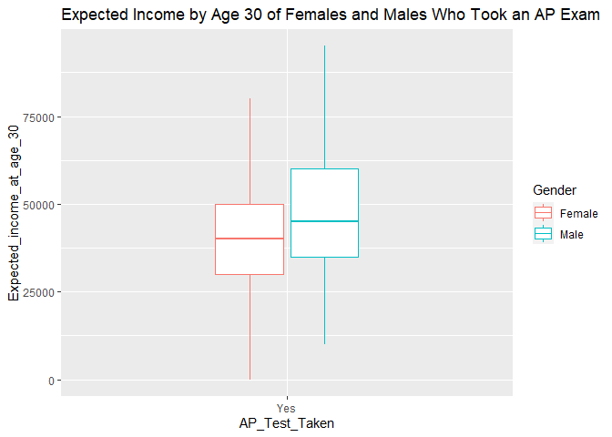
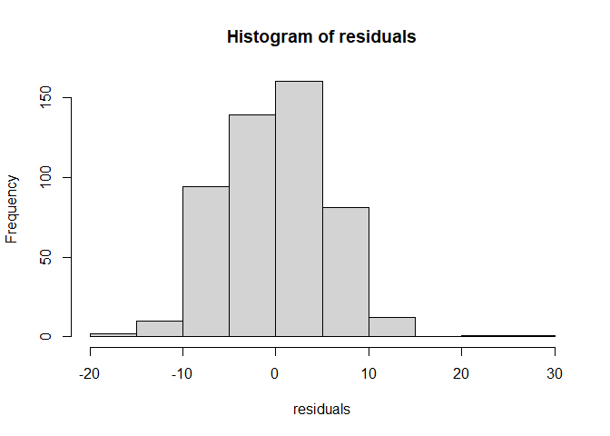
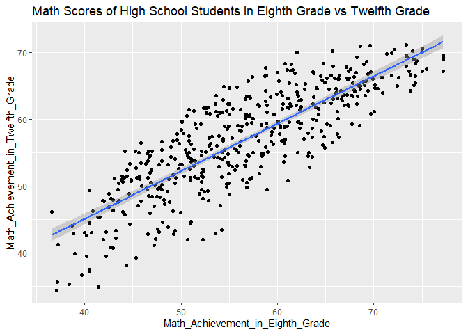
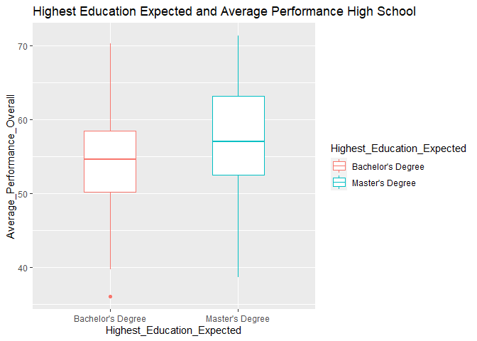
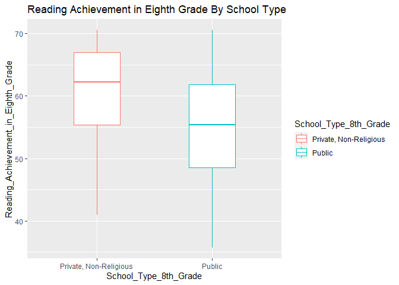

Statistical Analyses for Part II Writeup
================

## Importing Libraries

In the following block of code, I am importing the libraries that are
going to be useful for the six hypothesis testing

``` r
library("readxl")
```

    ## Warning: package 'readxl' was built under R version 4.1.3

``` r
library("tidyverse")
```

    ## Warning: package 'tidyverse' was built under R version 4.1.2

    ## -- Attaching packages --------------------------------------- tidyverse 1.3.1 --

    ## v ggplot2 3.3.5     v purrr   0.3.4
    ## v tibble  3.1.2     v dplyr   1.0.7
    ## v tidyr   1.1.3     v stringr 1.4.0
    ## v readr   1.4.0     v forcats 0.5.1

    ## -- Conflicts ------------------------------------------ tidyverse_conflicts() --
    ## x dplyr::filter() masks stats::filter()
    ## x dplyr::lag()    masks stats::lag()

``` r
library("ggplot2")
library("ggpubr")
```

    ## Warning: package 'ggpubr' was built under R version 4.1.3

## First Hypothesis Test: T-test comparing Expected Income of Males and Females Who Took AP Exams

Following the above hypothesis, in the following block of code, I am
comparing the expected income of males and females who took AP exams

``` r
my_data <- read_excel("RStats_ProjectII.xlsx", sheet = "Subset_AP")

#Makes boolean to create dataframe that contain males who took the AP Exams
male_bool_yesap <- (my_data["Gender"] == "Male") & (my_data["AP_Test_Taken"] == "Yes")
female_bool_yesap <- (my_data["Gender"] == "Female") & (my_data["AP_Test_Taken"] == "Yes")

male_yesap <- my_data[male_bool_yesap,]
female_yesap <- my_data[female_bool_yesap,]
#Merges the dataframes of male and females 
container <- merge(male_yesap, female_yesap, all = TRUE)

#Boxplot formed
ggplot(container) + geom_boxplot(width=.4, aes(x = AP_Test_Taken , y = Expected_income_at_age_30 , colour = Gender)) + ggtitle("Expected Income by Age 30 of Females and Males Who Took an AP Exam ")
```

<!-- -->

``` r
#Getting the summary statistics of each dataframe
summary(male_yesap$Expected_income_at_age_30)
```

    ##    Min. 1st Qu.  Median    Mean 3rd Qu.    Max. 
    ##   10000   35000   45000   47388   60000   95000

``` r
sd(male_yesap$Expected_income_at_age_30)
```

    ## [1] 16628.72

``` r
summary(female_yesap$Expected_income_at_age_30)
```

    ##    Min. 1st Qu.  Median    Mean 3rd Qu.    Max. 
    ##       0   30000   40000   42623   50000   80000

``` r
sd(female_yesap$Expected_income_at_age_30)
```

    ## [1] 16587.87

``` r
#T-test Performed
t.test(male_yesap[,"Expected_income_at_age_30"], female_yesap[,"Expected_income_at_age_30"])
```

    ## 
    ##  Welch Two Sample t-test
    ## 
    ## data:  male_yesap[, "Expected_income_at_age_30"] and female_yesap[, "Expected_income_at_age_30"]
    ## t = 2.1106, df = 212.68, p-value = 0.03598
    ## alternative hypothesis: true difference in means is not equal to 0
    ## 95 percent confidence interval:
    ##   314.746 9216.339
    ## sample estimates:
    ## mean of x mean of y 
    ##  47388.35  42622.81

## Second Hypothesis Chi Square Test:Teacher Perception and Average Performances

In this hypothesis test, I am determining if there is a relationship
between how a student perceives a child and the average performance of
that student during high school

``` r
# Information from excel sheet is read
average_perception <- read_excel("RStats_ProjectII.xlsx", sheet = "P")

#Table is produced
tablelized <- table(average_perception)
tablelized
```

    ##                                averages_classifications
    ## converted_df.teacher_perception Above Average Below Average
    ##               Agree                       722           750
    ##               Disagree                     83            89
    ##               Strongly Agree              166           158
    ##               Strongly Disagree            20            12

``` r
#Chi Square Test is Performed
chisq.test(average_perception$converted_df.teacher_perception, average_perception$averages_classifications)
```

    ## 
    ##  Pearson's Chi-squared test
    ## 
    ## data:  average_perception$converted_df.teacher_perception and average_perception$averages_classifications
    ## X-squared = 2.7777, df = 3, p-value = 0.4272

``` r
#There is no relationship between average performance of students and what their teachers perceive of them 
```

## Third Hypothesis: Chi Squared Test: Type of High School Program and Time Spent on Homework

The following block of code determines if there is a relationship
between the type of high school program and the time spent on homework

``` r
#Gets dataframe from excel sheet and converts it into a table 
school_type_hw <- read_excel("RStats_ProjectII.xlsx", sheet = "HomeworkTypeHighSchool")
#4-6, 1-3
school_type_hw_bool_1 <- school_type_hw[,"Time Spent on Homework out of School per Week in Twelfth Grade"] == "1-3 Hours"
school_type_hw_bool_4 <- school_type_hw[,"Time Spent on Homework out of School per Week in Twelfth Grade"] == "4-6 Hours"

holder_1 <- school_type_hw[school_type_hw_bool_1,]
holder_4 <- school_type_hw[school_type_hw_bool_4,]

#Now, we must combine both of the dataframes
container <- merge(holder_1, holder_4, all = TRUE)
table(container)
```

    ##                            Time Spent on Homework out of School per Week in Twelfth Grade
    ## Type of High School Program 1-3 Hours 4-6 Hours
    ##           Academic                 67        62
    ##           Other                     6         6
    ##           Rigorous Academic        26        41
    ##           Some Vocational          15         9

``` r
#Chi Squared is performed
chisq.test(container$`Time Spent on Homework out of School per Week in Twelfth Grade`, container$`Type of High School Program`)
```

    ## 
    ##  Pearson's Chi-squared test
    ## 
    ## data:  container$`Time Spent on Homework out of School per Week in Twelfth Grade` and container$`Type of High School Program`
    ## X-squared = 4.9845, df = 3, p-value = 0.1729

## Fourth Hypothesis Testing: Linear Regression: Math Achievement in Eighth Grade vs Math Achievement in Twelfth Grade

In this test, I perform an analysis to see if there is a correlation
between one’s math performance in eighth grade and their achievement in
twelfth grade

``` r
#Now let's do a linear regression test on the math performance
math_perform <- read_excel("RStats_ProjectII.xlsx", sheet = "MathRegion")
math_perform_model<- lm(Math_Achievement_in_Eighth_Grade ~ Math_Achievement_in_Twelfth_Grade, data = math_perform)
print(math_perform_model)
```

    ## 
    ## Call:
    ## lm(formula = Math_Achievement_in_Eighth_Grade ~ Math_Achievement_in_Twelfth_Grade, 
    ##     data = math_perform)
    ## 
    ## Coefficients:
    ##                       (Intercept)  Math_Achievement_in_Twelfth_Grade  
    ##                            2.9120                             0.9433

``` r
summary(math_perform_model)
```

    ## 
    ## Call:
    ## lm(formula = Math_Achievement_in_Eighth_Grade ~ Math_Achievement_in_Twelfth_Grade, 
    ##     data = math_perform)
    ## 
    ## Residuals:
    ##      Min       1Q   Median       3Q      Max 
    ## -16.9175  -4.1206   0.0457   4.0815  25.5958 
    ## 
    ## Coefficients:
    ##                                   Estimate Std. Error t value Pr(>|t|)    
    ## (Intercept)                        2.91203    1.84485   1.578    0.115    
    ## Math_Achievement_in_Twelfth_Grade  0.94328    0.03211  29.374   <2e-16 ***
    ## ---
    ## Signif. codes:  0 '***' 0.001 '**' 0.01 '*' 0.05 '.' 0.1 ' ' 1
    ## 
    ## Residual standard error: 5.656 on 498 degrees of freedom
    ## Multiple R-squared:  0.634,  Adjusted R-squared:  0.6333 
    ## F-statistic: 862.8 on 1 and 498 DF,  p-value: < 2.2e-16

``` r
#Finding the correlation 
correlation <- cor(math_perform$Math_Achievement_in_Eighth_Grade, math_perform$Math_Achievement_in_Twelfth_Grade)
print(correlation)
```

    ## [1] 0.7962713

``` r
#Gets the residual of the linear model 
residuals<-resid(math_perform_model)
hist(residuals)
```

<!-- -->

``` r
#Eliminates the residuals that are greater than 2 and -2
standard_residuals <- rstandard(math_perform_model)

math_model_better <- math_perform[c("Math_Achievement_in_Eighth_Grade", "Math_Achievement_in_Twelfth_Grade")]
math_sdres <- cbind(math_model_better, standard_residuals)

math_analysis <- math_sdres[(math_sdres$standard_residuals < 2) & (math_sdres$standard_residuals > -2),]

#Gets the summary
summary(lm(Math_Achievement_in_Eighth_Grade ~ Math_Achievement_in_Twelfth_Grade, data = math_analysis))
```

    ## 
    ## Call:
    ## lm(formula = Math_Achievement_in_Eighth_Grade ~ Math_Achievement_in_Twelfth_Grade, 
    ##     data = math_analysis)
    ## 
    ## Residuals:
    ##      Min       1Q   Median       3Q      Max 
    ## -10.7336  -3.8211   0.0377   3.9689  10.8695 
    ## 
    ## Coefficients:
    ##                                   Estimate Std. Error t value Pr(>|t|)    
    ## (Intercept)                        0.81766    1.68162   0.486    0.627    
    ## Math_Achievement_in_Twelfth_Grade  0.98001    0.02926  33.491   <2e-16 ***
    ## ---
    ## Signif. codes:  0 '***' 0.001 '**' 0.01 '*' 0.05 '.' 0.1 ' ' 1
    ## 
    ## Residual standard error: 5.061 on 481 degrees of freedom
    ## Multiple R-squared:  0.6999, Adjusted R-squared:  0.6992 
    ## F-statistic:  1122 on 1 and 481 DF,  p-value: < 2.2e-16

``` r
#Now, let's plot
ggplot(data=math_analysis, aes(x = Math_Achievement_in_Eighth_Grade, y = Math_Achievement_in_Twelfth_Grade)) +  geom_point() + geom_smooth(method="lm") + ggtitle("Math Scores of High School Students in Eighth Grade vs Twelfth Grade")
```

    ## `geom_smooth()` using formula 'y ~ x'

<!-- -->

``` r
#The correlation is 0.796 (0.8) suggesting a strong correlation - overall, it shows improvement in math achievement throughout high school
```

## Fifth Hypothesis Testing Comparison Of Means (t-test): Education Level and Average Performance in High School

In this test, I am comparing the average performance of those students
that are expected to earn bachelor’s against those that are expected to
get a masters degree

``` r
subjects_att_education <- read_excel("RStats_ProjectII.xlsx", sheet = "AveragePerHigh")
subjects_att_education <- subjects_att_education[, c("Highest_Education_Expected", "Average_Performance_Overall")]

#Let's find the average performance between Bachelors and PHD and make appropriate 
bachelors_bool <- subjects_att_education["Highest_Education_Expected"] == "Bachelor's Degree"
masters_bool <- subjects_att_education["Highest_Education_Expected"] == "Master's Degree"

bachelors_df <- subjects_att_education[bachelors_bool,]
masters_df <- subjects_att_education[masters_bool,]

#Getting the summary stats for bachelor's
summary(bachelors_df$Average_Performance_Overall)
```

    ##    Min. 1st Qu.  Median    Mean 3rd Qu.    Max. 
    ##   36.08   50.15   54.56   54.35   58.44   70.28

``` r
sd(bachelors_df$Average_Performance_Overall)
```

    ## [1] 6.435199

``` r
summary(masters_df$Average_Performance_Overall)
```

    ##    Min. 1st Qu.  Median    Mean 3rd Qu.    Max. 
    ##   38.64   52.51   56.99   57.36   63.13   71.29

``` r
sd(masters_df$Average_Performance_Overall)
```

    ## [1] 6.704662

``` r
#Both Dataframes are merged
container <- merge(bachelors_df, masters_df, all = TRUE)
ggplot(container) + geom_boxplot(width=.4, aes(x = Highest_Education_Expected , y = Average_Performance_Overall, colour = Highest_Education_Expected)) + ggtitle("Highest Education Expected and Average Performance High School ")
```

<!-- -->

``` r
#Now, let's get a t-test
t.test(bachelors_df[,"Average_Performance_Overall"], masters_df[,"Average_Performance_Overall"])
```

    ## 
    ##  Welch Two Sample t-test
    ## 
    ## data:  bachelors_df[, "Average_Performance_Overall"] and masters_df[, "Average_Performance_Overall"]
    ## t = -3.9061, df = 286.49, p-value = 0.0001171
    ## alternative hypothesis: true difference in means is not equal to 0
    ## 95 percent confidence interval:
    ##  -4.523906 -1.492307
    ## sample estimates:
    ## mean of x mean of y 
    ##  54.35044  57.35855

## Sixth Hypothesis Testing T-Test For Reading Achievement Between Public and Private, Non-Religious Schools

In this test, I am comparing the eighth grade reading achievement of
students attending public and private, non-religious schools

``` r
#T-test for the reading achievement (Public, Private, Non-Religious)
school_8th_reading <-read_excel("RStats_ProjectII.xlsx", sheet = "Reading8th")
public_bool <- school_8th_reading["School Type in Eighth Grade"] == "Public"
private_bool <- school_8th_reading["School Type in Eighth Grade"] == "Private, Non-Religious"

public_df <- school_8th_reading[public_bool,]
private_df <- school_8th_reading[private_bool,]
private_df <-private_df %>% rename("School_Type_8th_Grade" = "School Type in Eighth Grade")
public_df <- public_df %>% rename("School_Type_8th_Grade" = "School Type in Eighth Grade")
container <- merge(public_df, private_df, all = TRUE)

#Getting the summary statistics
summary(private_df$Reading_Achievement_in_Eighth_Grade)
```

    ##    Min. 1st Qu.  Median    Mean 3rd Qu.    Max. 
    ##   40.92   55.39   62.20   60.77   66.96   70.55

``` r
sd(private_df$Reading_Achievement_in_Eighth_Grade)
```

    ## [1] 7.862021

``` r
summary(public_df$Reading_Achievement_in_Eighth_Grade)
```

    ##    Min. 1st Qu.  Median    Mean 3rd Qu.    Max. 
    ##   35.74   48.53   55.40   55.27   61.87   70.55

``` r
sd(public_df$Reading_Achievement_in_Eighth_Grade)
```

    ## [1] 8.87039

``` r
ggplot(container) + geom_boxplot(width=.4, aes(x = School_Type_8th_Grade, y = Reading_Achievement_in_Eighth_Grade, colour = School_Type_8th_Grade)) + ggtitle("Reading Achievement in Eighth Grade By School Type ")
```

<!-- -->

``` r
t.test(public_df[,"Reading_Achievement_in_Eighth_Grade"], private_df[,"Reading_Achievement_in_Eighth_Grade"])
```

    ## 
    ##  Welch Two Sample t-test
    ## 
    ## data:  public_df[, "Reading_Achievement_in_Eighth_Grade"] and private_df[, "Reading_Achievement_in_Eighth_Grade"]
    ## t = -4.1481, df = 50.372, p-value = 0.0001288
    ## alternative hypothesis: true difference in means is not equal to 0
    ## 95 percent confidence interval:
    ##  -8.162461 -2.837241
    ## sample estimates:
    ## mean of x mean of y 
    ##  55.27165  60.77150
